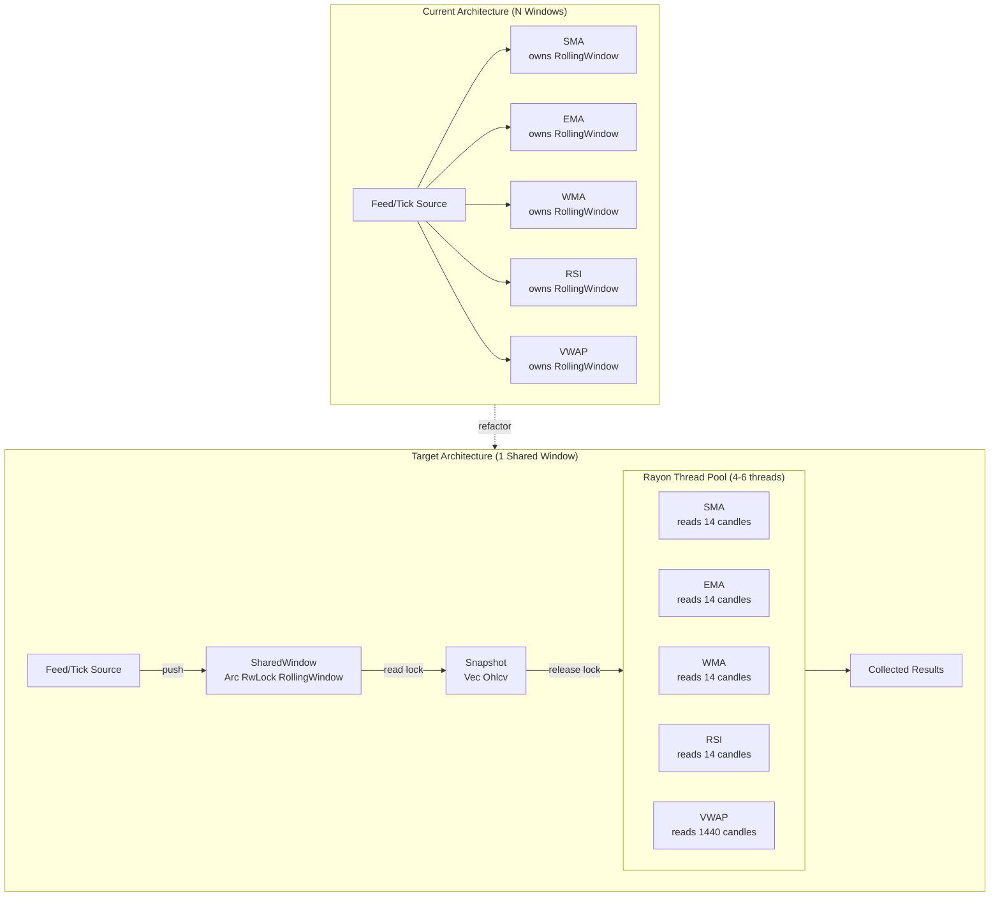
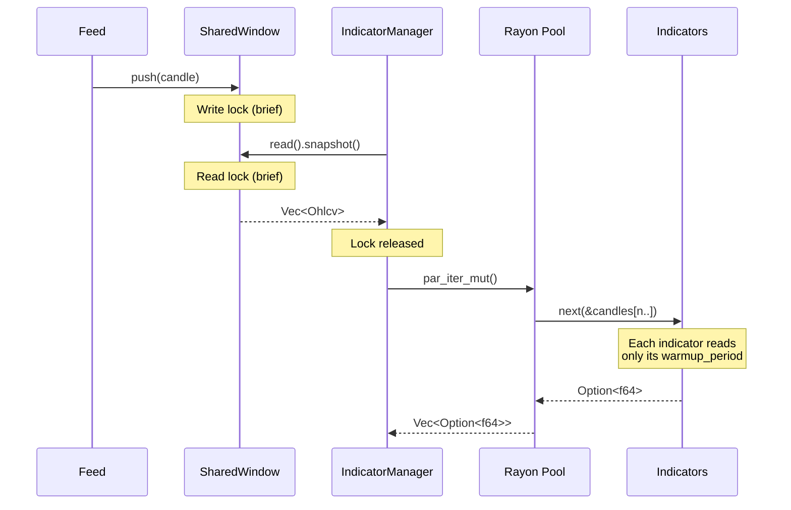
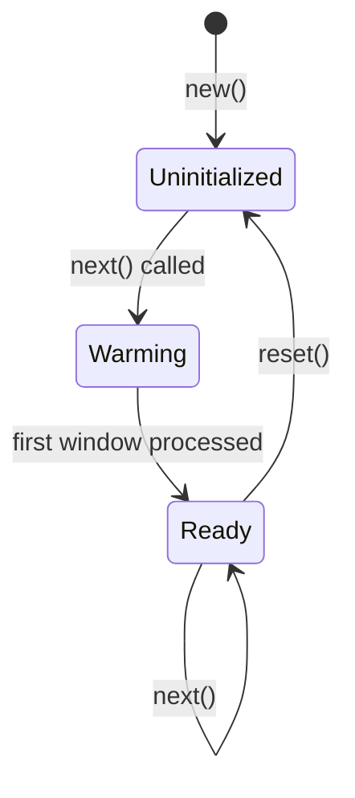
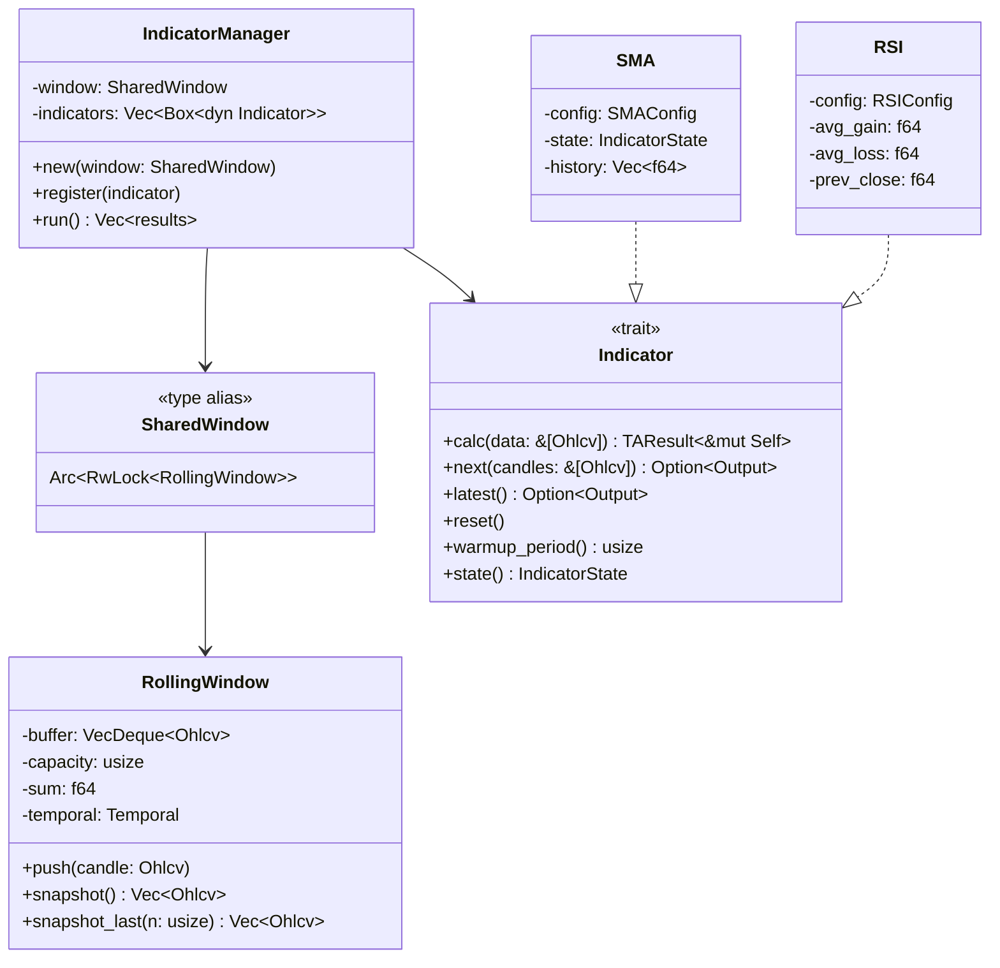
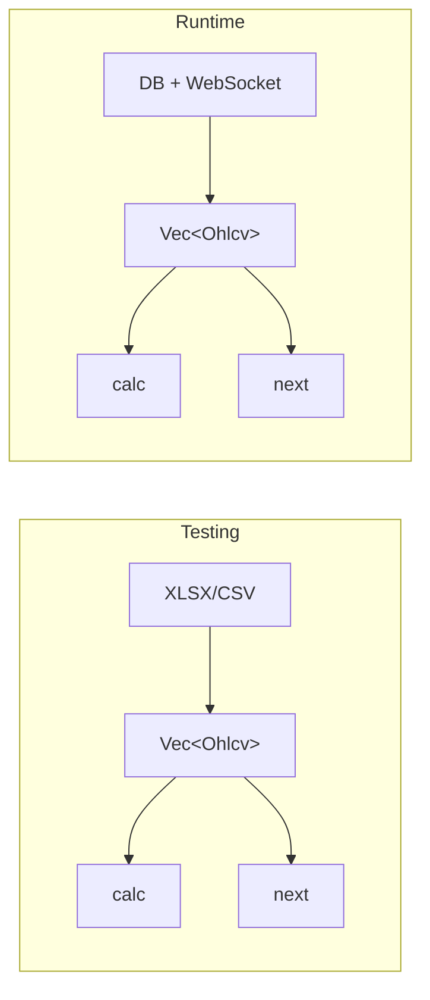

# Temporal Window and Indicator Manager Refactor

## Architecture Overview



## Data Flow (Per Tick)



## Indicator State Machine



**States:**
- `Uninitialized`: Indicator created, no data received yet
- `Warming`: Processing first RollingWindow snapshot
- `Ready`: First window processed, returns `Some(value)` on each `next()`

## Component Structure



## Data Format

**Single unified format: `&[Ohlcv]`**



> **Principle:** One data format everywhere. Tests mirror runtime exactly.

| Method | Input | Use Case |
|--------|-------|----------|
| `calc(&[Ohlcv])` | Full candle slice | Historical backfill from DB |
| `next(&[Ohlcv])` | Snapshot slice | Real-time streaming |

See [remove_ohlcv_series.md](remove_ohlcv_series.md) for migration plan from `OhlcvSeries`.

## Problem Statement

Current state: Each indicator owns its own `RollingWindow`, duplicating OHLCV data across N indicators. For a system with 10 indicators and a 1440-candle window, this means 10 separate buffers of identical data.

Target state: Single externally-managed `RollingWindow`, indicators peek via snapshots, parallel computation.

## Current Architecture

```
Feed → SMA (owns RollingWindow<14>)
     → EMA (owns RollingWindow<14>)
     → WMA (owns RollingWindow<14>)
     → RSI (no window, tracks prev_close/avg_gain/avg_loss)
     → VWAP (owns RollingWindow<1440>)
```

**Observations from code review:**
- `RollingWindow` in `src/ta/math/rolling.rs` stores `VecDeque<Ohlcv>`
- SMA creates window in constructor: `RollingWindow::new(config.period)`
- RSI doesn't use RollingWindow - tracks running averages
- Window already has `Temporal` support for real-time tick aggregation

## Target Architecture

```
Feed → SharedWindow (Arc<RwLock<RollingWindow>>)
                ↓ snapshot
     ┌──────────┼──────────┐
     ↓          ↓          ↓
   SMA(14)   EMA(14)   RSI(14)   [parallel via Rayon]
```

## Implementation Plan

### Phase 1: SharedWindow Type and Snapshot API

**File: `src/ta/math/rolling.rs`**

1. Add type alias:
   ```rust
   pub type SharedWindow = Arc<RwLock<RollingWindow>>;
   ```

2. Add snapshot method to RollingWindow that takes only N candles:
   ```rust
   /// Take snapshot of last N candles (for indicator-specific periods).
   pub fn snapshot_last(&self, n: usize) -> Vec<Ohlcv> {
       let len = self.buffer.len();
       if n >= len {
           self.buffer.iter().copied().collect()
       } else {
           self.buffer.iter().skip(len - n).copied().collect()
       }
   }
   ```

3. Add full snapshot for indicators needing entire window:
   ```rust
   pub fn snapshot(&self) -> Vec<Ohlcv> {
       self.buffer.iter().copied().collect()
   }
   ```

### Phase 2: Extend Existing Indicator Trait

**File: `src/ta/mod.rs`**

**Key Decision:** No separate `StreamIndicator` trait. Extend existing `Indicator` trait with `next()` method and deprecate `update()`.

**Rationale:**
- `warmup_period()` already exists (no need for `required_period()`)
- Avoids parallel trait hierarchy
- Single trait, two modes: batch (`calc`) and streaming (`next`)

**Changes:**

1. Add `next()` method for snapshot-based streaming:
   ```rust
   pub trait Indicator: Send + Sync {
       type Output: Clone + Send;
       type Config: Clone + Default;

       fn state(&self) -> IndicatorState;

       /// Batch calculation from candle slice.
       fn calc(&mut self, data: &[Ohlcv]) -> TAResult<&mut Self>;

       /// Streaming calculation from shared-window snapshot.
       /// Receives slice of candles (last N based on warmup_period).
       /// Returns None during warmup, Some(output) when ready.
       fn next(&mut self, candles: &[Ohlcv]) -> Option<Self::Output>;

       fn latest(&self) -> Option<Self::Output>;
       fn reset(&mut self);
       fn warmup_period(&self) -> usize;

       // DEPRECATED - remove after migration
       // fn update(&mut self, tick: &Ohlcv) -> TAResult<Option<Self::Output>>;
   }
   ```

2. Why `next(&[Ohlcv])` replaces `update(&Ohlcv)`:

   | Aspect | `update(&Ohlcv)` | `next(&[Ohlcv])` |
   |--------|------------------|------------------|
   | Window ownership | Indicator owns window | External shared window |
   | Data received | Single tick | Snapshot slice |
   | Push logic | Indicator manages | IndicatorManager manages |
   | Parallel-safe | No (mutable window) | Yes (immutable snapshot) |

### Phase 3: Refactor Indicators

**Pattern for each indicator:**

1. Remove owned `RollingWindow` field
2. Keep internal state (e.g., RSI's `avg_gain`, `avg_loss`)
3. Implement `next(&[Ohlcv])` method
4. Remove `update(&Ohlcv)` method (or keep as deprecated wrapper)

**SMA example:**
```rust
impl Indicator for SMA {
    type Output = f64;
    type Config = SMAConfig;

    fn next(&mut self, candles: &[Ohlcv]) -> Option<Self::Output> {
        if candles.len() < self.config.period {
            self.state = self.state.increment(self.config.period);
            return None;
        }

        // Take last `period` candles, compute mean
        let sum: f64 = candles.iter()
            .rev()
            .take(self.config.period)
            .map(|c| c.close.0)
            .sum();

        let sma = sum / self.config.period as f64;
        self.latest = Some(sma);
        self.history.push(sma);
        self.state = IndicatorState::Ready;
        Some(sma)
    }

    fn warmup_period(&self) -> usize {
        self.config.period
    }

    // ... other trait methods unchanged
}
```

**RSI example (stateful):**
```rust
impl Indicator for RSI {
    type Output = f64;
    type Config = RSIConfig;

    fn next(&mut self, candles: &[Ohlcv]) -> Option<Self::Output> {
        // RSI only needs the latest candle to compute delta
        let latest = candles.last()?;
        let close = latest.close.0;

        if self.state.is_uninitialized() {
            self.prev_close = close;
            self.state = IndicatorState::Warming { count: 1 };
            return None;
        }

        let delta = close - self.prev_close;
        let gain = delta.max(0.0);
        let loss = (-delta).max(0.0);

        // Wilder's smoothing (same logic as current update())
        match self.state {
            IndicatorState::Warming { count } => {
                self.avg_gain += gain;
                self.avg_loss += loss;

                if count >= self.config.period {
                    self.avg_gain /= self.config.period as f64;
                    self.avg_loss /= self.config.period as f64;
                    let rsi = Self::calculate_rsi(self.avg_gain, self.avg_loss);
                    self.prev_close = close;
                    self.state = IndicatorState::Ready;
                    Some(rsi)
                } else {
                    self.prev_close = close;
                    self.state = IndicatorState::Warming { count: count + 1 };
                    None
                }
            }
            IndicatorState::Ready => {
                let p_1 = (self.config.period - 1) as f64;
                self.avg_gain = (self.avg_gain * p_1 + gain) / self.config.period as f64;
                self.avg_loss = (self.avg_loss * p_1 + loss) / self.config.period as f64;
                self.prev_close = close;
                Some(Self::calculate_rsi(self.avg_gain, self.avg_loss))
            }
            _ => None,
        }
    }

    fn warmup_period(&self) -> usize {
        self.config.period + 1  // Need period deltas
    }
}
```

**Key insight:** Stateful indicators (RSI, EMA, ATR) only need the latest candle from the snapshot. The manager can optimize by passing `&candles[candles.len()-1..]` for these.

### Phase 4: IndicatorManager with Rayon

**File: `src/ta/manager.rs` (new)**

```rust
use rayon::prelude::*;
use std::sync::{Arc, RwLock};
use crate::ta::{Indicator, math::SharedWindow};

/// Manages a shared window and runs indicators in parallel.
pub struct IndicatorManager<O: Clone + Send> {
    window: SharedWindow,
    indicators: Vec<Box<dyn Indicator<Output = O>>>,
}

impl<O: Clone + Send + 'static> IndicatorManager<O> {
    pub fn new(window: SharedWindow) -> Self {
        Self { window, indicators: Vec::new() }
    }

    pub fn register(&mut self, indicator: Box<dyn Indicator<Output = O>>) {
        self.indicators.push(indicator);
    }

    /// Run all indicators in parallel, return results.
    pub fn run(&mut self) -> Vec<Option<O>> {
        // Take snapshot once (short read lock)
        let snapshot = {
            let guard = self.window.read().unwrap();
            guard.snapshot()
        };

        // Parallel compute using next()
        self.indicators
            .par_iter_mut()
            .map(|ind| {
                let period = ind.warmup_period();
                let candles = if period >= snapshot.len() {
                    &snapshot[..]
                } else {
                    &snapshot[snapshot.len() - period..]
                };
                ind.next(candles)
            })
            .collect()
    }
}
```

**Usage example:**
```rust
// Create shared window (sized for longest indicator period)
let window: SharedWindow = Arc::new(RwLock::new(
    RollingWindow::with_timeframe(1440, 60)  // 1440 candles, 1m timeframe
));

// Create manager
let mut manager = IndicatorManager::new(Arc::clone(&window));

// Register indicators
manager.register(Box::new(SMA::new(SMAConfig::new(14))));
manager.register(Box::new(EMA::new(EMAConfig::new(14))));
manager.register(Box::new(RSI::new(RSIConfig::new(14))));

// Feed loop
loop {
    let tick = receive_tick();  // from websocket/exchange

    // Push to shared window
    {
        let mut w = window.write().unwrap();
        w.push_with_timestamp(tick);
    }

    // Run all indicators in parallel
    let results = manager.run();

    // Process results...
}
```

### Phase 5: Thread Pool Configuration

**File: `src/lib.rs` or dedicated config**

```rust
use rayon::ThreadPoolBuilder;

pub fn init_thread_pool(num_threads: usize) {
    ThreadPoolBuilder::new()
        .num_threads(num_threads.min(6)) // Cap at 6
        .build_global()
        .expect("Failed to build thread pool");
}
```

## Migration Strategy

### Backward Compatibility

The `Indicator` trait gains `next(&[Ohlcv])` method. Existing `calc()` and `update()` continue to work.

**Transition path:**
1. Add `next()` to trait with default implementation that panics (forces explicit impl)
2. Implement `next()` for each indicator
3. Deprecate `update()` with `#[deprecated]` attribute
4. Eventually remove `update()` and owned `RollingWindow` fields

### Incremental Rollout

1. Add `snapshot()` and `snapshot_last()` to `RollingWindow`
2. Add `SharedWindow` type alias
3. Add `next(&[Ohlcv])` to `Indicator` trait
4. Implement `next()` for SMA first (simplest)
5. Add `IndicatorManager`
6. Migrate remaining indicators one by one
7. Add Rayon parallel execution
8. Benchmark and tune thread count
9. Deprecate and remove `update()`

## Indicators to Migrate

| Indicator | Uses RollingWindow | Migration Complexity |
|-----------|-------------------|---------------------|
| SMA       | Yes               | Low                 |
| EMA       | Yes               | Low                 |
| WMA       | Yes               | Low                 |
| RSI       | No (stateful)     | Medium              |
| MACD      | No (uses EMA)     | Medium (composition)|
| ATR       | No (stateful)     | Medium              |
| ADX       | No (composed)     | High (dependency)   |
| VWAP      | Yes               | Low                 |
| BB        | Yes               | Low                 |

## Open Questions

1. **Temporal mode**: Should `SharedWindow` handle temporal aggregation, or should that happen before push?
   - Current: RollingWindow has `push_with_timestamp()` for temporal mode
   - Proposal: Keep temporal logic in SharedWindow, caller pushes ticks
   - **Decision needed:** Who is responsible for same-candle updates?

2. **History tracking**: Current indicators store `history: Vec<f64>`. Should this move to IndicatorManager?
   - Option A: Each indicator still tracks its own history
   - Option B: IndicatorManager stores `HashMap<&str, Vec<f64>>` of all indicator histories
   - **Recommendation:** Start with Option A (simpler migration)

3. **Error handling**: `next()` returns `Option<T>` (None = not enough data). Is this sufficient?
   - Current `update()` returns `TAResult` which can carry error context
   - `next()` only signals "no value yet" via None
   - **Proposal:** Keep `next()` infallible. Errors should be caught at configuration time, not runtime.

4. **Indicator identification**: How to identify indicators in manager results?
   - Option A: Return `Vec<Option<O>>` (position-based)
   - Option B: Return `Vec<(String, Option<O>)>` (named)
   - Option C: Return `HashMap<String, Option<O>>`
   - **Trade-off:** Simplicity vs debugging convenience

## Performance Considerations

- Snapshot cloning: 1440 candles × 48 bytes = ~69KB per tick (acceptable)
- If profiling shows issues, use `Arc<[Ohlcv]>` for zero-copy snapshots
- Rayon overhead: Minimal for CPU-bound indicator math
- Lock contention: Snapshot pattern keeps read lock duration to microseconds

## Dependencies

Add to `Cargo.toml`:
```toml
rayon = "1.10"
```

## Testing Strategy

1. **Equivalence tests**: Each indicator's `next()` produces same results as `update()` given same data
2. **Integration tests**: IndicatorManager produces same results as sequential indicator calls
3. **Benchmark**: Compare N-indicator performance before/after refactor
   - Measure: latency per tick, memory usage, CPU utilization
4. **Stress test**: High tick rate (1000+ ticks/sec) with 6+ indicators
5. **Concurrency tests**: Verify no race conditions under parallel execution
